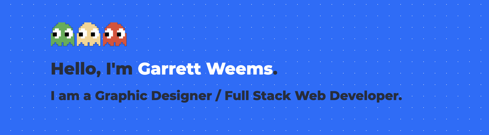

## I just like to build things! 🤓

- 🔭 I’m currently working on a <svg width="1em" height="1em" viewBox="0 0 16 16" class="bi bi-columns-gap" fill="currentColor" xmlns="http://www.w3.org/2000/svg">
  <path fill-rule="evenodd" d="M6 1H1v3h5V1zM1 0a1 1 0 0 0-1 1v3a1 1 0 0 0 1 1h5a1 1 0 0 0 1-1V1a1 1 0 0 0-1-1H1zm14 12h-5v3h5v-3zm-5-1a1 1 0 0 0-1 1v3a1 1 0 0 0 1 1h5a1 1 0 0 0 1-1v-3a1 1 0 0 0-1-1h-5zM6 8H1v7h5V8zM1 7a1 1 0 0 0-1 1v7a1 1 0 0 0 1 1h5a1 1 0 0 0 1-1V8a1 1 0 0 0-1-1H1zm14-6h-5v7h5V1zm-5-1a1 1 0 0 0-1 1v7a1 1 0 0 0 1 1h5a1 1 0 0 0 1-1V1a1 1 0 0 0-1-1h-5z"/>
  </svg> [CSS Grid Layout Creator][supergrid9k]!
- 🌱 I’m currently learning next.js / recoil.js / everything.js 🤣
- 👯 I’m looking to collaborate with other content creators
- 🥅 2020 Goals: Contribute more to Open Source projects
- ⚡ Fun fact: I'm working on restoring a 1978 Honda CB750 Motorcycle

 
 

### Connect with me:

[][website]
[][linkedin]
[][instagram]

 
 

### Languages and Tools:

[][website]
[][website]
[][website]
[][website]
[][website]
[][website]
[][website]
[][website]
[][website]
[][website]
[][website]
[][website]
[][website]
[][website]
[][website]
[][website]

 
 

---

  
:zap: Github Stats

  

[website]: https://glweems.com
[instagram]: https://instagram.com/glweems
[linkedin]: https://linkedin.com/in/glweems
[supergrid9k]: https://supergrid9k.dev
