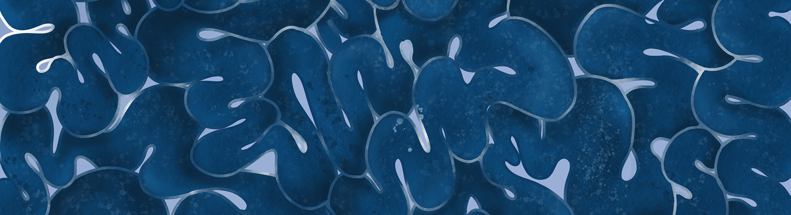
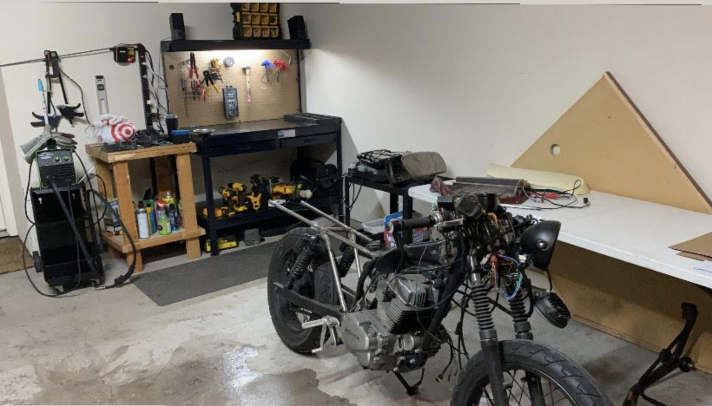
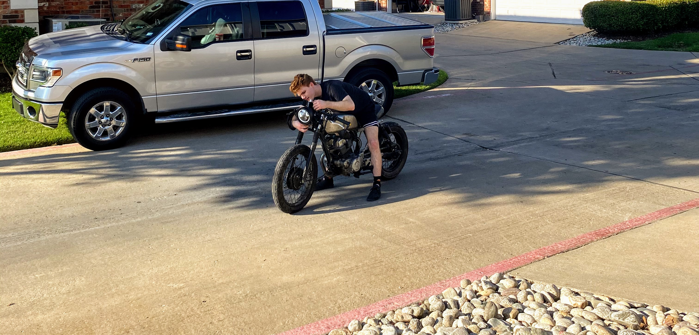

# Howdy, I'm Garrett Weems

### Give me a shout

[][github]

[][linkedin]

[][website]

I'm a web developer and graphic designer from Texas

I use HTML, CSS and JavaScript. Though constantly changing, my focus right now is React.js, Typescript, Node, Express, Gatsby and Next.js

I am 23 and have been making websites for about 6 years.

Making super fast websites that are highly responsive and a pleasure to use is what makes me love developement.

I enjoying learning cutting edge technologies and teaching what I have learned to new programmers whenever given the opportunity.

### A little more...

Since I can remember I have always had a natural curiousity for technology whether it was jailbreaking my moms initial iPhone at the age of 9 or building a Hackintosh computer just to see if I could do it. During highschool I found my love for art in gerneral but more specifically good design. From there I started getting into frontend web developemnt which I describe as perfect blend of my passion for technology and design and haven't looked back since.

### When I'm not coding

When I'm not coding I have been learning fabrication and welding to for restoration of a 1991 Honda motorcyle cafe racer build

## I just like to create

- 🔭 I’m currently working on a [CSS Grid Layout Creator!][supergrid9k]
- 🌱 I’m currently learning next.js / recoil.js / everything.js 🤣
- 👯 I’m looking to collaborate with other content creators
- 🥅 2020 Goals: Contribute more to Open Source projects / further fabrication skills

[github]: https://github.com/glweems
[website]: https://glweems.com
[instagram]: https://instagram.com/glweems
[linkedin]: https://linkedin.com/in/glweems
