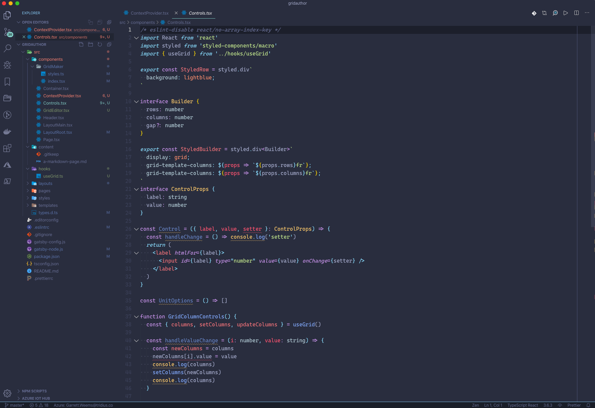
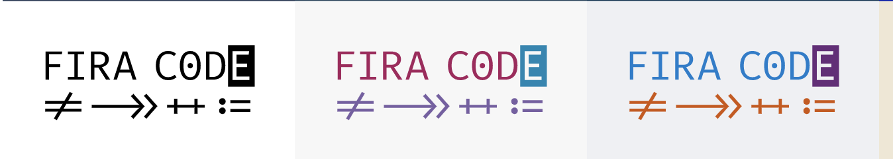
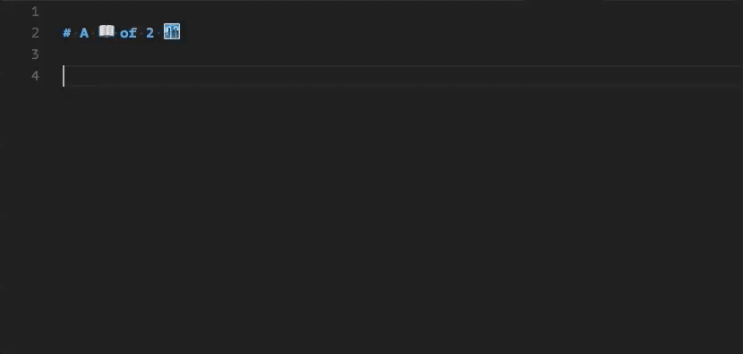
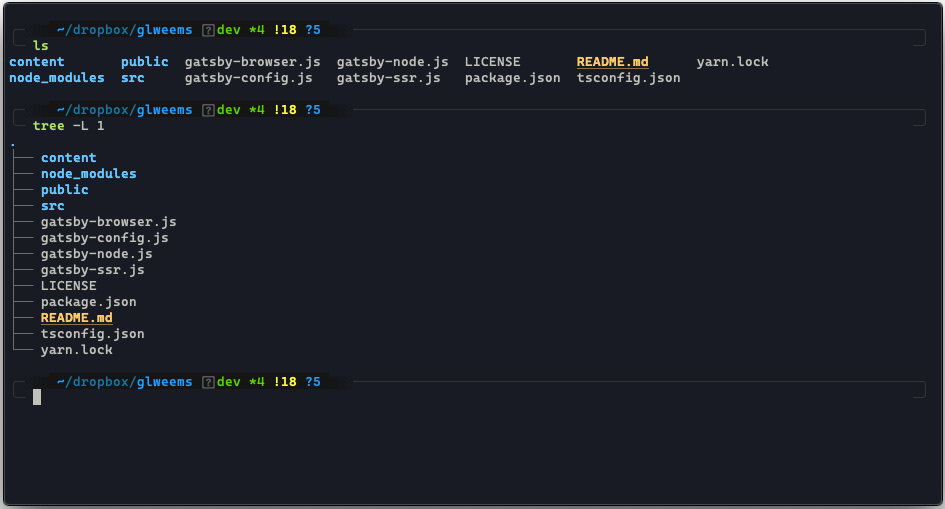
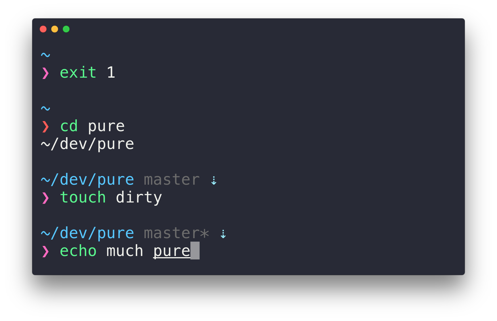

# Personal Dev Environment

## My favorite extensions, themes, tips for a beautifully productive development environment

<info></info>

---

### Programs

> Programs I use on a daily basis

- Visual Studio Code

- Alfred 4

- Insomnia

- TablePlus

- GraphQL IDE

- CleanMyMac

### VS Code Setup

My vscode setup isn’t anything super crazy but I have managed to get it looking pretty snazzy.

### Font

[Fira Code](https://github.com/tonsky/FiraCode)

_Fira Code Font_

### Extensions

- [vscode-material-palenight-theme](https://github.com/whizkydee/vscode-material-palenight-theme)

- [https://github.com/ghmcadams/vscode-lintlens](https://github.com/ghmcadams/vscode-lintlens)

- [https://github.com/ChristianKohler/NpmIntellisense](https://github.com/ChristianKohler/NpmIntellisense)

- [https://github.com/octref/polacode](https://github.com/octref/polacode)

- [https://github.com/Huachao/vscode-restclient](https://github.com/Huachao/vscode-restclient)

#### [Emojisense](https://github.com/mattbierner/vscode-emojisense)

> Adds suggestions and autocomplete for emoji

_Emojisense_

#### [Turbo Console Log](https://github.com/Chakroun-Anas/turbo-console-log)

> If you have to use console.log(), this is the fastest way possible

### Terminal Setup

Always looking for improvements but damn I love this setup

> Since I’m a tinker-er and indecisive I switch between iTerm2 & Hyper because I love everything the guys at Zeit produce

### Setup

If you haven’t already, you’re going to want to get your terminal shell moved from bash to [ZSH](https://github.com/robbyrussell/oh-my-zsh/wiki/Installing-ZSH).

Now you can install [oh-my-zsh](https://ohmyz.sh/)

### Prompt

_[Prompt Pure](https://github.com/sindresorhus/pure)_

Instead of an oh-my-zsh theme, I am using [Prompt Pure](https://github.com/sindresorhus/pure)

Just love how simple this prompt is
