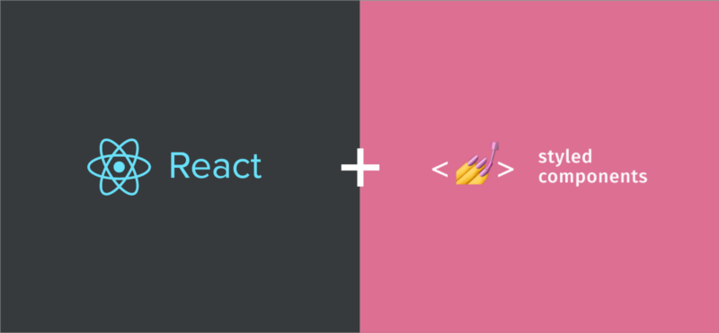

#responsive-container

# Responsive Container Component with React and Styled-Components.



## Setup

First things first you're going to need to install the _styled-components_ node package.

`npm install --save styled-components`

Now we are able to start creating our Theme object.

This will act like sass / scss / less variables and we will be able use them across all of our components.

```javascript
// Theme.js
export const Theme = {
  colors: {
    dark: `#24292e`,
    light: `#EEEEEE`,
    primary: `#ff5851`
  },
  fontFamily: {
    header: 'Source Sans Pro',
    body: 'Roboto'
  },
  padding: '1rem 0.5rem'
}

export const Breakpoints = {
  mobileS: 320,
  mobileM: 375,
  mobileL: 425,
  tablet: 639,
  laptop: 1140,
  laptopL: 1440,
  desktop: 2560
}

export const MQ = {}
for (const key in ScreenSizes) {
  if (key)
    MQ[key] = styles =>
      `@media screen and (min-width: ${ScreenSizes[key]}px) { ${styles} }`
}
export default Theme
```

> I like to create a _Theme.js_ file in my src/ directory to store my Theme obj and Breakpoints object.

## Usage

```javascript
import Theme from 'theme'

const Container = styled.div`
  max-width: 100%;
  margin: 0 auto;
  padding: ${Theme.padding};
  ${MQ.laptopL(`max-width: 1140px`)}
  ${MQ.desktop(`max-width: 1440px`)};
`
```
