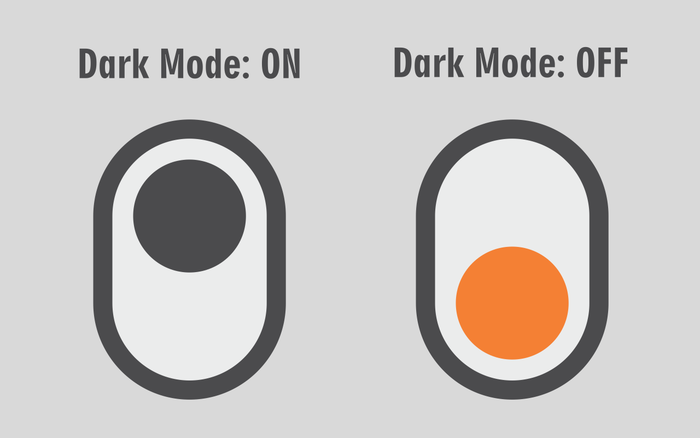

# gatsby dark mode

## create a dynamic dark-mode theme in gatsby using redux, and styled components



<p align="center">
  <a href="https://gatsby-darkmode.now.sh">Demo</a>
  ·
  <a href="https://github.com/gwtuts/gatsby-darkmode">GitHub Repo</a>
</p>

---

### Getting Starting

In your Gatsby project run

```
npm install --save react-redux redux styled-components
```

Or

```
yarn add redux react-redux styled-components
```

### Step 1.

Create a new folder in your src/ directory called _state_
Within this folder create the following files

```
src/
└── state/
    ├── reducers.js
    ├── actions.js
    └── ReduxWrapper.js
```

Step 2.
Create redux reducer

```javascript
// reducers.js
import { combineReducers } from "redux"
import { TOGGLE_THEME } from "./actions"

const initialState = {
  isDarkMode: false,
}

const theme = (state = initialState, action) => {
  switch (action.type) {
    case TOGGLE_THEME:
      return {
        ...state,
        isDarkMode: !state.isDarkMode,
      }
    default:
      return state
  }
}

export default combineReducers({ theme })
```

Step 3.
create redux action to toggle current theme

```javascript
// actions.js
export const TOGGLE_THEME = `TOGGLE_THEME`
export const toggleTheme = () => ({ type: TOGGLE_THEME })
```

Step 4. Create our Provider / ReduxWrapper Component
Now we are able to go ahead a create the ReduxWrapper component

```javascript
import { composeWithDevTools } from "redux-devtools-extension"
import { Provider } from "react-redux"
import { createStore } from "redux"
import rootReducer from "./reducers"
import React from "react"

const store = createStore(rootReducer, composeWithDevTools())

export default ({ element }) => <Provider store={store}>{element}</Provider>
```

composeWithDevTools() is optional but allows you to use the redux chrome extension that is very helpful for debugging

now that we have our ReduxWrapper component created, open up the ~gatsby-browser.js~ and the ~gatsby-ssr.js~ and add the following to **both**

```javascript
export { default as wrapRootElement } from "./src/state/ReduxWrapper"
```

Step 5.
Create our ToggleTheme button component

in the src/components/ create a new file named **ToggleThemeButton.js**

this is going to be a basic functional component that will allow us to connect to our state a trigger our reducer when we click the button

```js
// components/ToggleThemeButton.js
import React from "react"
import { connect } from "react-redux"
import { toggleTheme } from "../state/actions"

const ToggleThemeButton = ({ toggleTheme }) => (
  <button type="button" onClick={toggleTheme}>
    toggle
  </button>
)

const mapDispatchToProps = {
  toggleTheme,
}

export default connect(
  null,
  mapDispatchToProps
)(ToggleThemeButton)
```

Step 6.
making our redux state change our theme with styled-components

create a new file in your src/ directory called theme

first start by creating an object of shared styles such as font, accent colors, font weight, anything you like.

```js
const sameStyles = { font: "Roboto", accent: "blue" }
```

now create your light and dark objects, they must have the same keys but different values for this for work

```js
export const light = { fg: "black", bg: "white", ...sameStyles }

export const dark = { fg: "white", bg: "black", ...sameStyles }

// we use the spread operator at the end of each object to add our same styles to each
```

now in the same file we are going to create our HOC component

```js
import { createGlobalStyle } from "styled-components"

export const GlobalStyle = createGlobalStyle`
html,body {
  background:${props => props.theme.bg};
  color:${props => props.theme.fg};
}`
```

Step 7.
connecting everything together!
ok we're almost there
open up layout.js component and import everything from our theme

```js
import { GlobalStyle, light, dark } from "../theme"
import { ThemeProvider } from "styled-components"
import { connect } from "react-redux"
const Layout = ({ children, isDarkMode }) => (
// ..
)
  render={data => (
      <ThemeProvider theme={isDarkMode ? light : dark}>
          <GlobalStyle />
          // ...
      </ThemeProvider>
    )}


const mapStateToProps = state => ({
  isDarkMode: state.theme.isDarkMode,
})

export default connect(mapStateToProps)(Layout)
```

And there you have it!

a fully functional dark-mode site using gatsby, redux, and styles-components

<iframe src="https://codesandbox.io/embed/github/gwtuts/gatsby-darkmode/tree/master/?autoresize=1&fontsize=14&hidenavigation=1&view=preview" title="gatsby-darkmode" style="width:100%; height:500px; border:0; border-radius: 4px; overflow:hidden;" sandbox="allow-modals allow-forms allow-popups allow-scripts allow-same-origin"></iframe>
